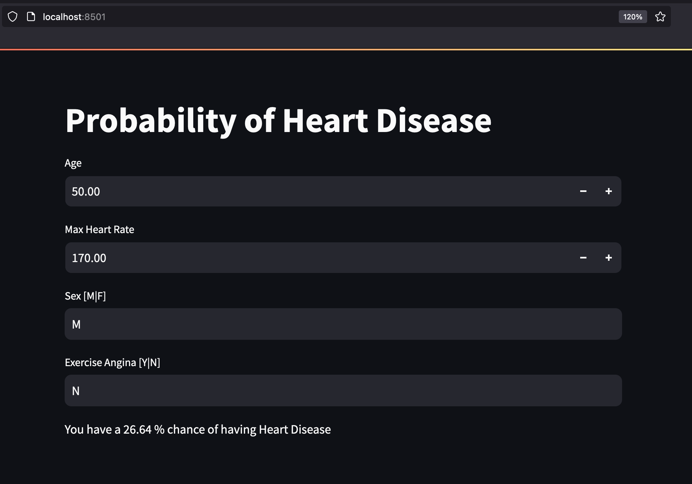

# Probability of Heart Failure - Website

This is a Web Application where users can enter their own information and it outputs their likelihood of having some form of heart disease. Keep in mind that heart disease is a broad term that covers incidents like strokes, heart attacks, and heart failure. 

## About the Dataset

This Data was downloaded from Kaggle: 
https://www.kaggle.com/datasets/fedesoriano/heart-failure-prediction/data

Ideally we would have a lot more data than this in order to confidently draw conclusions. However, for this project we will pretend that there is enough.  

# The Website



## Running the Website

```
$ cd streamlit
$ streamlit run main.py
```

# Exploratory Data Analysis

A basic Exploratory Data Alaysis (EDA) can be seen in this file: [Heart Disease EDA Notebook](./EDA/EDA.ipynb). <-- Check it out! 

# Machine Learning: Preprocessing, Training, and Evaluating

A simple round of training a Logistic Regression model can be seen in this file: [Training and Evaluation Notebook](./training/training.ipynb). <-- Check it out! 
